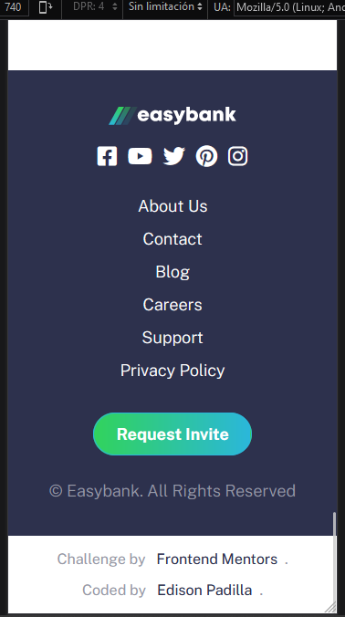

# Frontend Mentor - Easybank landing page solution

This is a solution to the [Easybank landing page challenge on Frontend Mentor](https://www.frontendmentor.io/challenges/easybank-landing-page-WaUhkoDN). Frontend Mentor challenges help you improve your coding skills by building realistic projects.

## Table of contents

- [Overview](#overview)
  - [The challenge](#the-challenge)
  - [Screenshot](#screenshot)
  - [Links](#links)
- [My process](#my-process)
  - [Built with](#built-with)
- [Author](#author)

## Overview

### The challenge

Users should be able to:

- View the optimal layout for the site depending on their device's screen size
- See hover states for all interactive elements on the page

### Screenshot

### Links

- Solution URL: [solution repository](https://github.com/EdisonPadilla/easybank-landing-page-solution)
- Live Site URL: [live site](https://edisonpadilla.github.io/easybank-landing-page-solution/)

## My process

### Built with

- Semantic HTML5 markup
- CSS custom properties
- Flexbox
- CSS Grid
- Google Fonts: [Google Fonts](https://fonts.google.com/)
- Font Awesome: [Font Awesome](https://fontawesome.com/)
- Normalize.css: [Normalize.css](https://necolas.github.io/normalize.css/)

## Author

- Frontend Mentor - [@Evanny](https://www.frontendmentor.io/profile/Evanny)
